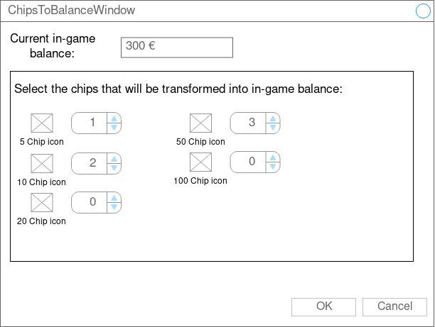
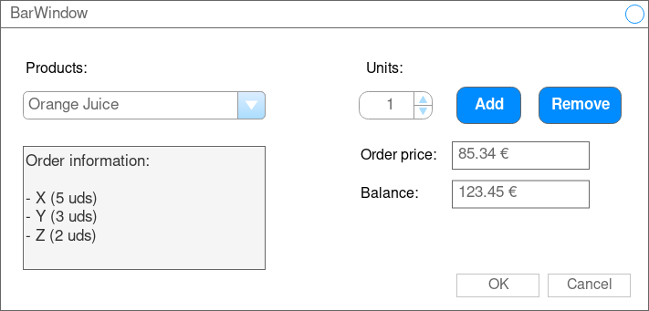

# Design process - GUI

We were required to design a desktop emulating a casino's game roulette. After reading the product requirements we have created the following *graphical user interface*, consisting on the following views:

## GameWindow

GameWindow (View Figure 1) is the main window and therefore  central part of the application. It has the following modules:
 
- **Spinning wheel**: contains a timer specifying the time until the roulette is spinned, an image representing the wheel and a text area showing the results of the previous round.
- **Bets**: represented by a table showing the user's current bets for the current round, as well as a *Bet* button for placing them.
- **Chips**: list of all chip types followed by the number of chips of that type that the user has. Again, there is a *Chips* button for recharging them.
- **Balance**: user's current balance in euros.
- **Bar**: beberage icon alongside a *Bar* label that opens the bar view.
- **Log out**: button for logging out of the application.
- **Menu**: menu for quick access of every other module in the application.

{height=350px}

## SignInWindow

SignInWindow (View Figure 2) is a dialog with a form that manages the credentials of the user. The user must have already signed up before being able to log in using this view. If the user has not signed up yet, he can do so by clicking on the *Sign Up* button located in the *New User* section.

{height=350px}

## SignUpWindow

SignUpWindow (View Figure 3) is a dialog with a form that manages the starting credentials of the user. The user must introduce their username and a desired password. Note that two users **can not share the same username**.

{height=350px}

## BankWindow

BankWindow (View Figure 4) is a dialog with the user's current balance in euros and four buttons for:

- Recharging their *in-game* balance
- Get chips for the roulette.
- Transfer their *in-game* balance back to their bank account.
- Transfer chips to *in-game* balance.

{height=350px}

## BankCredentialsWindow

BankCredentialsWindow (View Figure 5) is a dialog that manages the user's bank account credentials each time they want to perform an operation related to their bank account.

{height=350px}

## RechargeWindow

RechargeWindow (View Figure 6) is a dialog with a form asking the user for the balance they want to extract from their account.

{height=350px}

## ChipsWindow

ChipsWindow (View Figure 7) is a dialog with all chip types and a correspondent spinner asking the user for the number of chips from each type they want to extract. Spinners will keep adding chips until the balance threshold is reached.

{height=350px}

## BalanceToBankWindow

TransferWindow (View Figure 8) is a dialog that lets the user transfer their *in-game* balance back to their bank account.

{height=350px}

## ChipsToBalanceWindow

ChipsToBalanceWindow (View Figure 9) is a dialog that lets the user transfer their chips to *in-game* balance.

{height=350px}

## BetWindow

BetWindow (View Figure 10) is a dialog that lets the user place their bets for the current round. It has the following components:

- A combo box with the different bets that the user can make. Depending on the selected one, the panel that manages the bet configuration will change for that specific type of bet.
- Dynamic configuration panel with the current bet details and a button for placing it.
- Text area showing all the bets the user has made for this round, with buttons for adding a bet, modifying it, removing it or removing all of them.
- Text fields informing the user for the total price of all current bets and the possible income if the user wins.

{height=350px}

## BarWindow

BarWindow (View Figure 11) is a dialog modeling the bar of the casino. It has a list of products for the user to select and add or remove to or from the cart, as well as the total price for the order and the user's current balance. The cart is shown as well with the information of all the products in the order with their respective units.

{height=350px}

# Flow Layout

# Changes applied after user tests

